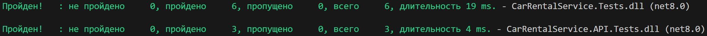

# Лабораторная работа №2
## «Сервер» - Реализация серверного приложения с использованием REST API

Во второй лабораторной работе реализовала серверное приложение, которое должно:
- Осуществлять базовые CRUD-операции с реализованными в первой лабораторной сущностями
- Предоставлять результаты аналитических запросов (раздел «Unit-тесты» задания).

### Предметная область - «Пункт проката автомобилей»:
В базе данных службы проката автомобилей содержится информация о парке транспортных средств, клиентах и аренде.

Автомобиль характеризуется поколением модели, госномером, цветом.
Поколение модели является справочником и содержит сведения о годе выпуска, объеме двигателя, типе коробки передач, модели. Для каждого поколения модели указывается стоимость аренды в час.
Модель является справочником и содержит сведения о названии модели, типе привода, числе посадочных мест, типе кузова, классе автомобиля.

Клиент характеризуется номером водительского удостоверения, ФИО, датой рождения.

При выдаче автомобиля клиенту фиксируется время выдачи и указывается время аренды в часах.

### Тесты пройдены

