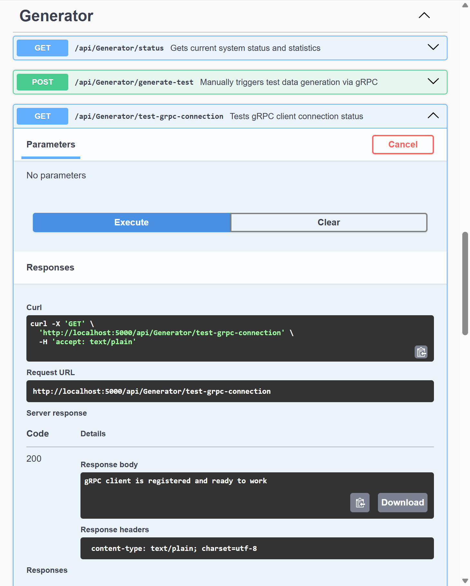
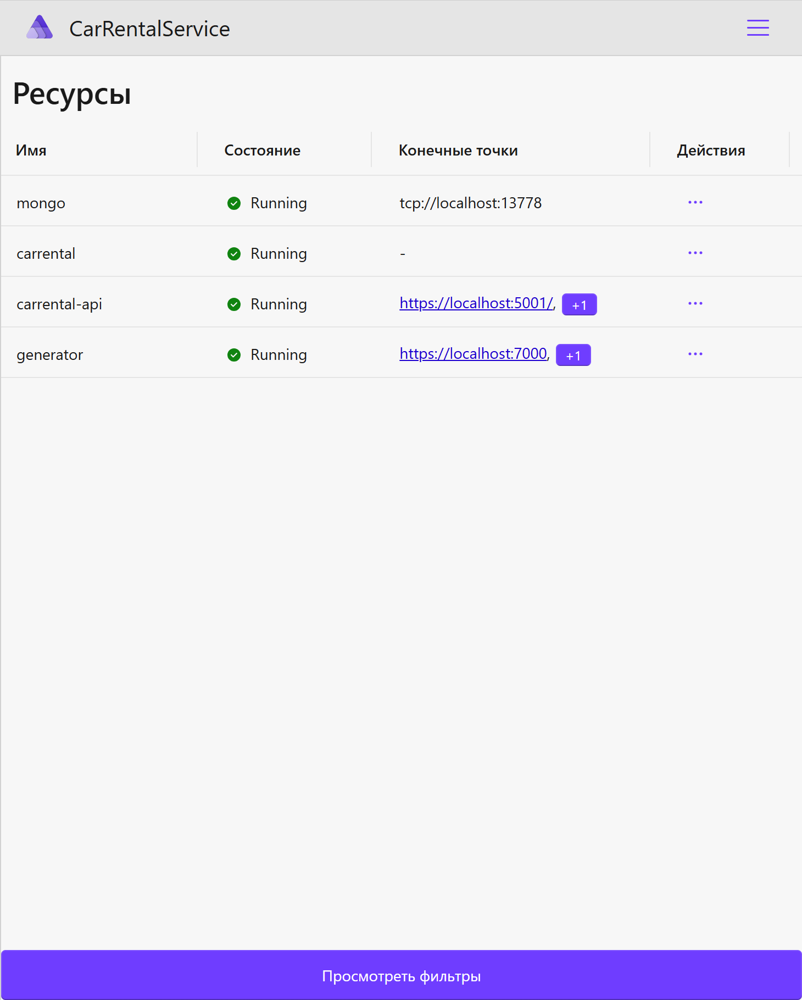

# Лабораторная работа №4
## «Инфраструктура» - Реализация сервиса генерации данных и его интеграция с сервером

В четвертой лабораторной работе имплементировала сервис, который генерирует контракты. Контракты передаются в сервер и сохраняются в бд, отправка контрактов выполняется при помощи gRPC в потоковом виде. Сервис представляет из себя отдельное приложение без референсов к серверным проектам.
Также добавила запуск генератора в конфигурацию Aspire.

### Предметная область - «Пункт проката автомобилей»:
В базе данных службы проката автомобилей содержится информация о парке транспортных средств, клиентах и аренде.

Автомобиль характеризуется поколением модели, госномером, цветом.
Поколение модели является справочником и содержит сведения о годе выпуска, объеме двигателя, типе коробки передач, модели. Для каждого поколения модели указывается стоимость аренды в час.
Модель является справочником и содержит сведения о названии модели, типе привода, числе посадочных мест, типе кузова, классе автомобиля.

Клиент характеризуется номером водительского удостоверения, ФИО, датой рождения.

При выдаче автомобиля клиенту фиксируется время выдачи и указывается время аренды в часах.

### Swagger работает корректно

